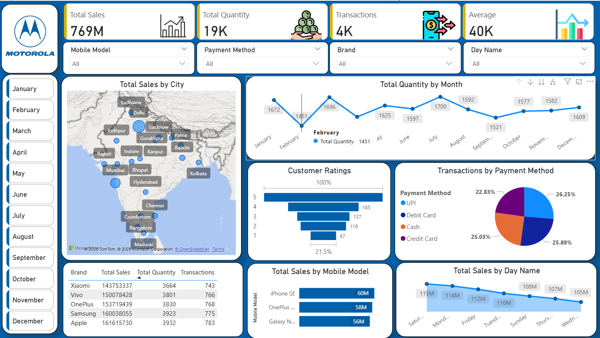

# Mobile Sales Analysis Dashboard

## Tools Used
- Power BI
- Power Query
- DAX

## Project Overview
This project analyzes mobile sales data to identify
sales trends, revenue performance, and product insights.

## Key Analysis
- Total Sales
- Revenue
- Brand-wise performance
- Product-wise sales
- Monthly sales trends

## Skills Demonstrated
- Data Cleaning
- Data Transformation
- Data Modeling
- DAX
- Data Visualization
## Dashboard Preview

